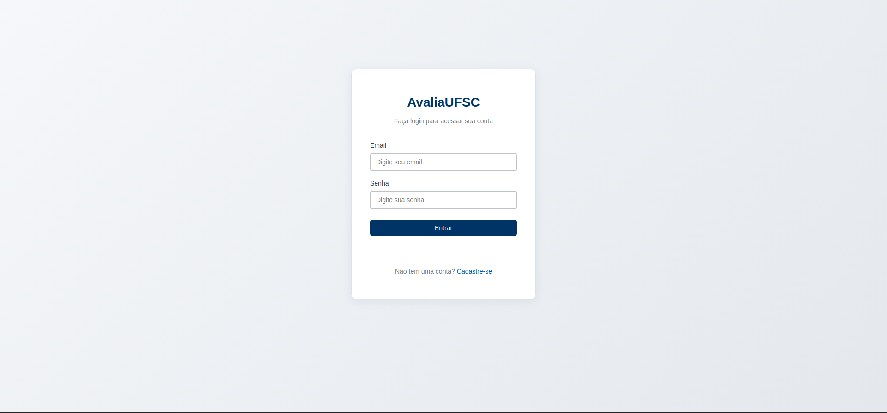

# 🎓 AvaliaUFSC

> Sistema de avaliação de professores e disciplinas desenvolvido para estudantes da Universidade Federal de Santa Catarina (UFSC)


---

## 📸 Screenshots

<details>
<summary>🔐 Tela de Login</summary>

<!--  -->
*Screenshot da tela de login*

</details>

<details>
<summary>🔍 Busca de Disciplinas</summary>

<!--  -->
*GIF demonstrando a busca fuzzy com suporte a nome de professor*

</details>

<details>
<summary>⭐ Avaliação de Professor</summary>

<!--  -->
*GIF do sistema de avaliação com estrelas interativas*

</details>

<details>
<summary>💬 Sistema de Comentários</summary>

<!--  -->
*GIF mostrando comentários com respostas aninhadas e votação*

</details>

---

## ✨ Funcionalidades

### 🔐 Sistema de Autenticação
- Login e registro com validação de **vínculo institucional via PDF**
- Perfis de usuário com avatar baseado em iniciais
- Controle de acesso por roles (**usuário/admin**)
- Proteção de rotas com Spring Security

### ⭐ Avaliação de Professores e Disciplinas
- Sistema de **rating com estrelas interativas** (1-5)
- Média de avaliações calculada em tempo real
- Avaliações separadas por professor e disciplina
- Histórico de avaliações do usuário

### 💬 Sistema de Comentários
- Comentários com suporte a **respostas aninhadas** (threads)
- **Upload de arquivos e imagens** em comentários
- Sistema de **upvote/downvote** estilo Reddit
- **Edição inline** de comentários próprios
- Soft delete com exclusão periódica automática

### 🔍 Busca Inteligente
- **Fuzzy search** com Fuse.js para tolerância a erros de digitação
- Busca por **nome de professor** como tags da disciplina
- **Cache local** (LocalStorage) com duração de 6 meses
- Navegação completa por **teclado** (↑↓ Enter Esc)
- Indicador visual quando match é por professor

### 🕷️ Web Scraping Automatizado
- Scraper do sistema **CAGR/UFSC** para disciplinas e professores
- Atualização automática do **semestre de atuação** dos professores
- Sincronização periódica de dados acadêmicos

### 📚 Mapa Curricular
- Organização de disciplinas por semestre
- Marcação de disciplinas cursadas e avaliadas
- Visualização do progresso acadêmico

---

## 🛠️ Stack Tecnológica

### Backend
| Tecnologia | Uso |
|------------|-----|
| **Java 21** | Linguagem principal |
| **Spring Boot 3** | Framework web |
| **Spring Security** | Autenticação e autorização |
| **Spring Data JPA** | Persistência de dados |
| **Hibernate** | ORM e mapeamento objeto-relacional |
| **H2 / PostgreSQL** | Banco de dados (dev/prod) |
| **Jsoup** | Web scraping do CAGR |
| **Docker** | Containerização do banco |

### Frontend
| Tecnologia | Uso |
|------------|-----|
| **Thymeleaf** | Template engine server-side |
| **JavaScript (ES6+)** | Interatividade e dinamismo |
| **Fuse.js** | Busca fuzzy client-side |
| **CSS3 Puro** | Estilos customizados (sem frameworks) |
| **LocalStorage** | Cache de dados no navegador |

### Padrões e Arquitetura
- **MVC** (Model-View-Controller)
- **DTO Pattern** (Data Transfer Objects)
- **Repository Pattern** (Acesso a dados)
- **Service Layer** (Lógica de negócio)
- **Modularização JS** (Code splitting)

---

## 📁 Estrutura do Projeto

```
src/
├── main/
│   ├── java/com/example/
│   │   ├── controller/        # Controllers REST e MVC
│   │   │   ├── AuthController.java
│   │   │   ├── ClassController.java
│   │   │   ├── ComentarioController.java
│   │   │   └── SearchController.java
│   │   ├── service/           # Lógica de negócio
│   │   │   ├── UsuarioService.java
│   │   │   ├── ComentarioService.java
│   │   │   └── AvaliacaoService.java
│   │   ├── repository/        # Interfaces JPA
│   │   ├── model/             # Entidades JPA
│   │   │   ├── Usuario.java
│   │   │   ├── Professor.java
│   │   │   ├── Disciplina.java
│   │   │   ├── Comentario.java
│   │   │   └── Avaliacao.java
│   │   ├── DTO/               # Data Transfer Objects
│   │   ├── config/            # Configurações Spring
│   │   └── scrapper/          # Web scraping CAGR
│   └── resources/
│       ├── static/
│       │   ├── css/           # Estilos (main.css, class.css, etc)
│       │   └── js/            # Scripts modulares
│       │       ├── classRender.js      # Renderização da página
│       │       ├── commentRender.js    # Renderização de comentários
│       │       ├── commentHandler.js   # CRUD de comentários
│       │       ├── avaliationHandler.js # Sistema de rating
│       │       └── searchBar.js        # Busca fuzzy
│       └── templates/         # Thymeleaf templates
│           ├── index.html
│           ├── class.html
│           └── fragments/
└── test/                      # Testes unitários e integração
```

---

## 📊 Diagrama de Entidades

```
┌──────────────┐         ┌───────────────────────┐         ┌──────────────┐
│   Usuario    │         │ ProfessorDisciplina   │         │   Professor  │
├──────────────┤    ┌───>│   (Entidade Pivot)    │<───┐    ├──────────────┤
│ id           │    │    ├───────────────────────┤    │    │ id           │
│ email        │    │    │ professor_id (FK)     │────┘    │ nome         │
│ nome         │    │    │ disciplina_id (FK)    │────┐    │ siape        │
│ matricula    │    │    │ semestre              │    │    └──────────────┘
│ curso        │    │    └───────────────────────┘    │           │
│ role         │    │                                 │           │
└──────────────┘    │    ┌───────────────────────┐    │           │
       │            │    │     Disciplina        │<───┘           │
       │            │    ├───────────────────────┤                │
       │            │    │ codigo (PK)           │                │
       │            │    │ nome                  │                │
       │            │    │ cargaHoraria          │                │
       │            │    └───────────────────────┘                │
       │                          │                               │
       │                          │                               │
       ▼                          ▼                               │
┌──────────────┐         ┌───────────────────────┐                │
│  Avaliacao   │         │     Comentario        │<───────────────┘
├──────────────┤         ├───────────────────────┤
│ id           │         │ id                    │
│ nota (1-5)   │         │ conteudo              │
│ usuario_id   │         │ usuario_id (FK)       │
│ professor_id │         │ professor_id (FK)     │
│ disciplina_id│         │ disciplina_id (FK)    │
└──────────────┘         │ parent_id (FK)        │◄── Self-reference
                         │ upvotes / downvotes   │    (respostas)
                         │ deleted (soft delete) │
                         └───────────────────────┘
                                   │
                                   ▼
                         ┌───────────────────────┐
                         │       Arquivo         │
                         ├───────────────────────┤
                         │ id                    │
                         │ nome                  │
                         │ tipo                  │
                         │ dados (BLOB)          │
                         │ comentario_id (FK)    │
                         └───────────────────────┘
```

---

## 🚀 Como Executar

### Pré-requisitos
- Java 21
- Maven 3.9+
- Docker (apenas para modo produção)

### Modo Desenvolvimento (H2 Database)

```bash
# Clone o repositório
git clone https://github.com/Itaxo01/Projeto-Engenharia-de-Software.git

# Entre no diretório
cd Projeto-Engenharia-de-Software

# Execute a aplicação
mvn spring-boot:run

# Acesse em http://localhost:8080
```

### Modo Produção (PostgreSQL)

1. **Configure as variáveis de ambiente** criando um arquivo `.env`:

```bash
# Admin User Configuration
ADMIN_EMAIL=admin@ufsc.br
ADMIN_PASSWORD=sua_senha_segura
ADMIN_NOME=Administrador
ADMIN_MATRICULA=000000
ADMIN_CURSO=Administração

# Database Configuration
DATABASE_URL=jdbc:postgresql://localhost:5432/academic_system
DATABASE_USERNAME=postgres
DATABASE_PASSWORD=postgres
```

2. **Inicie o PostgreSQL com Docker**:

```bash
# Carregue as variáveis
source .env

# Inicie o container
sudo docker compose up -d postgres

# Verifique se está rodando
sudo docker ps
```

3. **Execute a aplicação**:

```bash
SPRING_PROFILES_ACTIVE=prod mvn spring-boot:run
```

---

## 🔒 Nota sobre Acesso

> ⚠️ **Este sistema é de uso exclusivo de estudantes da UFSC** e requer validação de vínculo institucional (upload de atestado de matrícula em PDF) para registro.
>
> O código-fonte está disponível publicamente para fins **educacionais** e de **portfólio**, demonstrando conhecimentos em desenvolvimento fullstack com Java/Spring Boot.

---

## 👥 Autores

| Nome | GitHub |
|------|--------|
| Kauan Fank | [@kauanfank](https://github.com/kauanfank) |
| Luam | - |

---

## 📝 Licença

Este projeto está sob a licença MIT - veja o arquivo [LICENSE](LICENSE) para detalhes.

---

<p align="center">
  Desenvolvido como projeto da disciplina de <strong>Engenharia de Software</strong> - UFSC 2025
</p>