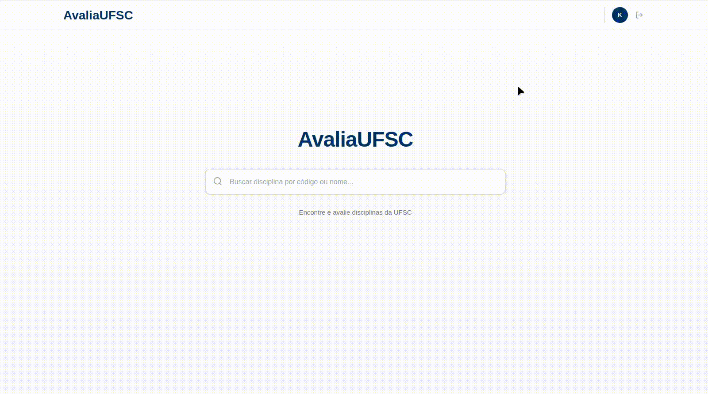

# 🎓 AvaliaUFSC

> Professor and course rating system developed for students at the Federal University of Santa Catarina (UFSC), Brazil


---

## 📸 Screenshots

<details>
<summary> Full usage</summary>


*Full usage gif for the project.*

</details>

<details>
<summary> Login and Registry</summary>


*Registry and login, showing the alerts for wrong verification documents*

</details>

<details>
<summary>Course Search</summary>


*GIF demonstrating fuzzy search with professor name support*

</details>

<details>
<summary>Professor Rating and Comment System</summary>


*GIF of the interactive star rating system*

</details>

---

##  Features

### Usage
- The project provides a very easy-to-use platform for a **RateMyProfessor application**, developed exclusively for the Federal University of Santa Catarina.
- The user just needs to create an account and search for the professor they want to know about, or leave an opinion about a specific class. The system **ensures** that if there is a professor or course in the university, the user **will find it** right away on the search bar (more on how that works below).
- The user can rate the professor or the course with 1-5 stars and leave comments with attached documents. The comments are interactive—other users are free to reply to them or leave a like/dislike. 

### Comment and rating system
- The main component of the project is the **comment and rating system**.
- The comment system is heavily inspired by **Reddit style**, with upvotes and downvotes, and also **threaded replies**.
- The comments can also contain **images and documents**, restricted by size and type for security reasons.
- The ratings are limited to **one per tuple** of (user, professor, course), and the averages are calculated and shown on the stars accordingly. 
- Both comments and ratings **can be deleted** by the user if they wish. Any comment can also be deleted by an admin user.

### Course and professor data gathering
- **All the data** of the university courses and professors is automatically gathered through **web scraping using JSoup**. 
- This makes the usage of the application much more dynamic, as all the courses and professors will be there without the need to be manually added.
- The scraper feature can be controlled on the frontend by any user with the Admin role. The user that executes the scraper needs to insert their credentials for the institution account, as it is required for the scraper.
- What the scraper does is, basically, log in to the institution website with the credentials provided, and from there access the page with the class registration search form. From there, it searches for all the different campuses of the university across different semesters, building the courses table and the professors table in the database.

### Search Bar
- The fuzzy search bar uses **FuseJS** to load the results directly on the user's machine. 
- The backend sends the DTO needed for that just after the user makes a successful login, and it stays in **local storage**. The system will not load it again unless it changes, making the experience **faster**.
- The search bar allows searching by course code, name, or even professor who teaches it. It evaluates the best options according to the Fuse configuration, and then shows the top results to the user.

### User
- The system also provides a page for the user, although not that important of a feature.
- The user can do some basic things there, like change their password or delete the account.
- Upon account deletion, all the user's site usage data (comments/ratings) is also deleted.
- It's worth noting that, even with this, the site usage remains anonymous for other users. It's not possible to tell who made a comment or left a rating.

### Security
- The system was designed with the intention that **only authorized users** could access the features. For that, the registration requires a specific institutional document.
- The verification of the document is **automatic** via the **institution API**. This ensures that only students who have that verifiable document are able to register themselves. The system also gathers useful data from the file.
- The passwords are **encrypted** using BCrypt before storing them in the database, guaranteeing security. All sensitive requests are POST.
- **Users are anonymous to other users**, ensuring safety for the reviews. 

---

## Tech Stack

### Backend
| Technology | Usage |
|------------|-------|
| **Java 21** | Main language |
| **Spring Boot 3** | Web framework |
| **Spring Security** | Authentication and authorization |
| **Spring Data JPA** | Data persistence |
| **Hibernate** | ORM and object-relational mapping |
| **H2 / PostgreSQL** | Database (dev/prod) |
| **Jsoup** | CAGR web scraping |
| **Docker** | Database containerization |

### Frontend
| Technology | Usage |
|------------|-------|
| **Thymeleaf** | Server-side template engine |
| **JavaScript (ES6+)** | Interactivity and dynamism |
| **Fuse.js** | Client-side fuzzy search |
| **Pure CSS3** | Custom styles (no frameworks) |
| **LocalStorage** | Browser data caching |

### Patterns and Architecture
- **MVC** (Model-View-Controller)
- **DTO Pattern** (Data Transfer Objects)
- **Repository Pattern** (Data access)
- **Service Layer** (Business logic)
- **JS Modularization** (Code splitting)

---

## 📁 Project Structure

```
src/
├── main/
│   ├── java/com/example/
│   │   ├── controller/        # REST and MVC Controllers
│   │   │   ├── AdminAPIController.java
│   │   │   ├── ArquivoController.java
│   │   │   ├── AvaliacaoController.java
│   │   │   ├── ComentarioController.java
│   │   │   ├── CustomErrorController.java
│   │   │   ├── DisciplinaController.java
│   │   │   ├── IndexController.java
│   │   │   ├── LoginController.java
│   │   │   ├── LogoutController.java
│   │   │   ├── MainController.java
│   │   │   ├── RegisterController.java
│   │   │   ├── SearchController.java
│   │   │   └── UserAPIController.java
│   │   ├── service/           # Business logic
│   │   │   ├── ArquivoComentarioService.java
│   │   │   ├── AvaliacaoService.java
│   │   │   ├── ComentarioService.java
│   │   │   ├── DisciplinaService.java
│   │   │   ├── HashingService.java
│   │   │   ├── PdfValidationService.java
│   │   │   ├── ProfessorService.java
│   │   │   ├── ScrapperStatusService.java
│   │   │   ├── SessionService.java
│   │   │   └── UsuarioService.java
│   │   ├── repository/        # JPA Interfaces
│   │   ├── model/             # JPA Entities
│   │   │   ├── Usuario.java
│   │   │   ├── Professor.java
│   │   │   ├── Disciplina.java
│   │   │   ├── Comentario.java
│   │   │   └── Avaliacao.java
│   │   ├── DTO/               # Data Transfer Objects
│   │   ├── config/            # Spring Configurations
│   │   ├── factory/           # Factory classes
│   │   └── scrapper/          # CAGR Web scraping
│   └── resources/
│       ├── static/
│       │   ├── css/           # Styles (main.css, class.css, etc)
│       │   └── js/            # Modular scripts
│       │       ├── admin.js            # Admin panel
│       │       ├── avaliationHandler.js # Rating system
│       │       ├── class.js            # Class page main
│       │       ├── classRender.js      # Page rendering
│       │       ├── commentHandler.js   # Comment CRUD
│       │       ├── commentRender.js    # Comment rendering
│       │       ├── index.js            # Index page
│       │       ├── loading-utils.js    # Loading utilities
│       │       ├── register.js         # Registration page
│       │       ├── searchBar.js        # Fuzzy search
│       │       ├── user.js             # User page
│       │       └── util.js             # Utility functions
│       └── templates/         # Thymeleaf templates
│           ├── index.html
│           ├── class.html
│           └── fragments/
└── test/                      # Unit and integration tests
```

---

## Entity Diagram

```
┌──────────────┐         ┌───────────────────────┐         ┌──────────────┐
│    User      │         │ ProfessorDisciplina   │         │   Professor  │
├──────────────┤    ┌───>│    (Pivot Entity)     │<───┐    ├──────────────┤
│ id           │    │    ├───────────────────────┤    │    │ id           │
│ email        │    │    │ professor_id (FK)     │────┘    │ name         │
│ name         │    │    │ disciplina_id (FK)    │────┐    │ siape        │
│ studentId    │    │    │ semester              │    │    └──────────────┘
│ course       │    │    └───────────────────────┘    │           │
│ role         │    │                                 │           │
└──────────────┘    │    ┌───────────────────────┐    │           │
       │            │    │       Course          │<───┘           │
       │            │    ├───────────────────────┤                │
       │            │    │ code (PK)             │                │
       │            │    │ name                  │                │
       │            │    │ workload              │                │
       │            │    └───────────────────────┘                │
       │                          │                               │
       │                          │                               │
       ▼                          ▼                               │
┌──────────────┐         ┌───────────────────────┐                │
│   Rating     │         │       Comment         │<───────────────┘
├──────────────┤         ├───────────────────────┤
│ id           │         │ id                    │
│ score (1-5)  │         │ content               │
│ user_id      │         │ user_id (FK)          │
│ professor_id │         │ professor_id (FK)     │
│ course_id    │         │ course_id (FK)        │
└──────────────┘         │ parent_id (FK)        │◄── Self-reference
                         │ upvotes / downvotes   │    (replies)
                         │ deleted (soft delete) │
                         └───────────────────────┘
                                   │
                                   ▼
                         ┌───────────────────────┐
                         │        File           │
                         ├───────────────────────┤
                         │ id                    │
                         │ name                  │
                         │ type                  │
                         │ data (BLOB)           │
                         │ comment_id (FK)       │
                         └───────────────────────┘
```

---

## Getting Started

### Prerequisites
- Java 21
- Maven 3.9+
- Docker (production mode only)

### Development Mode (H2 Database)

```bash
# Clone the repository
git clone https://github.com/Itaxo01/Projeto-Engenharia-de-Software.git

# Enter the directory
cd Projeto-Engenharia-de-Software

# Run the application
mvn spring-boot:run

# Access at http://localhost:8080
```

### Production Mode (PostgreSQL)

1. **Set up environment variables** by creating a `.env` file:

```bash
# Admin User Configuration
ADMIN_EMAIL=admin@ufsc.br
ADMIN_PASSWORD=your_secure_password
ADMIN_NOME=Administrator
ADMIN_MATRICULA=000000
ADMIN_CURSO=Administration

# Database Configuration
DATABASE_URL=jdbc:postgresql://localhost:5432/academic_system
DATABASE_USERNAME=postgres
DATABASE_PASSWORD=postgres
```

2. **Start PostgreSQL with Docker**:

```bash
# Load the variables
source .env

# Start the container
sudo docker compose up -d postgres

# Verify it's running
sudo docker ps
```

3. **Run the application**:

```bash
SPRING_PROFILES_ACTIVE=prod mvn spring-boot:run
```

---

## 🔒 Access Notice

> ⚠️ **This system is exclusively for UFSC students** and requires institutional affiliation validation (enrollment certificate PDF upload) to register.
>
> The source code is publicly available for **educational** and **portfolio** purposes, demonstrating fullstack development skills with Java/Spring Boot.

---

## 📝 License

This project is licensed under the MIT License - see the [LICENSE](LICENSE) file for details.

---

<p align="center">
  Developed as a project for the <strong>Software Engineering</strong> course, maintained as a hobby - UFSC 2025
</p>